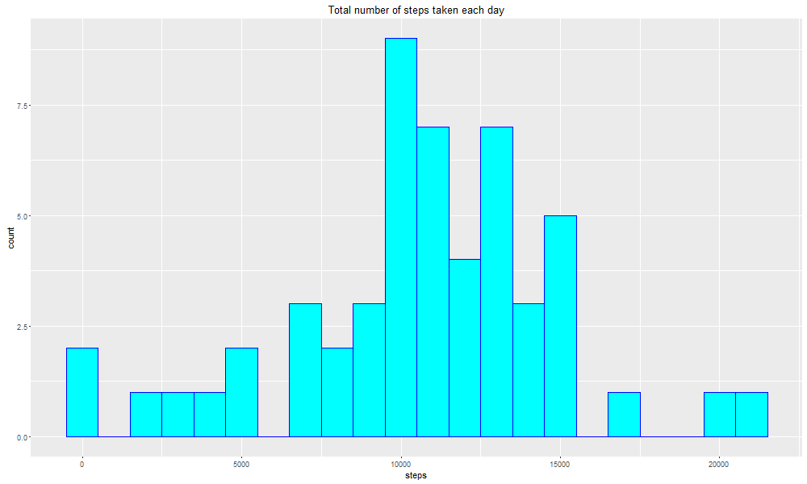

### jordiac, November 2016


## Loading and Processing the data

First we load the library needed to plot results: 

```r
library(ggplot2)
```


Then we load the data:

```r
## ********  1) Checking if file exists in our wd *************
name1 <- "activity.csv"
lname <- c(name1)
list_name <- dir(path=".")

verif1 <- lname %in% list_name

if (verif1[1] == TRUE ){
        print("Reading file 'activity.csv' ")
} else {
        print("file is missing in your working directory")
        stop()
}
```

```
## [1] "Reading file 'activity.csv' "
```

```r
##----------------------------------------------------------

##***********  2) Reading the file *************************
dades <- read.table(file= name1 , header=TRUE, sep=",")
##----------------------------------------------------------
```


## What is mean total number of steps taken per day?


```r
### Calculate the total number of steps taken per day
sumstep <- aggregate(steps~date, dades, sum, na.rm=TRUE)
head(sumstep)
```

```
##         date steps
## 1 2012-10-02   126
## 2 2012-10-03 11352
## 3 2012-10-04 12116
## 4 2012-10-05 13294
## 5 2012-10-06 15420
## 6 2012-10-07 11015
```

```r
### histogram of the total number of steps taken each day
g <- ggplot(sumstep, aes(steps))
g + geom_histogram(color="blue", fill="cyan",binwidth = 1000) +
        labs(title="Total number of steps taken each day")
```


```r
### mean and median of the total number of steps taken per day
mean1 <- mean(sumstep$steps)
mean1 <- format(mean1, scientific=FALSE)
mean1
```

```
## [1] "10766.19"
```

```r
median1 <- median(sumstep$steps)
median1
```

```
## [1] 10765
```

```r
##-----------------------------------------------------------------
```
So the mean and median of the total number of steps taken per day are 10766.19 and 10765.


## What is the average daily activity pattern?

```r
#### subsetting data
sub2 <- aggregate(steps~interval, dades, mean, na.rm=TRUE)   

#### plotting
g <- ggplot(sub2, aes(x=interval, y=steps))
g + geom_line(color="blue",size=1) +
        labs(title="Average number of steps taken by 5min interval")
```


```r
#### 5 minute interval containing the max. number of steps
maxaver <- max(sub2$steps)
maxaver
```

```
## [1] 206.1698
```

```r
maxint <- subset(sub2, steps==maxaver)$interval
maxint
```

```
## [1] 835
```

```r
##-----------------------------------------------------------------
```
So the maximum number of steps is 206.1698113 which is in interval 835.


## Imputing missing values


```r
###  Calculate the number of NA values 
nalist <- is.na(dades$steps)

### Filling NA values: using the average for the interval and creating new data set
step2 <- replace(dades$steps, nalist, sub2$steps[match(dades$interval[nalist],sub2$interval)])
dades2 <- dades
dades2$steps <- step2

### histogram of the total number of steps taken each day with //modified data set//
sumstep2 <-aggregate(steps~date, dades2, sum)
g <- ggplot(sumstep2, aes(x=steps))
g + geom_histogram(color="red", fill="orange", binwidth = 1000) +
        labs(title="Total number of steps taken each day //modified//")
```


```r
### mean and median of the total number of steps taken per day //modified data set//
mean2 <- mean(sumstep2$steps)
mean2 <- format(mean2, scientific=FALSE)
mean2
```

```
## [1] "10766.19"
```

```r
median2 <- median(sumstep2$steps)
median2 <- format(median2, scientific=FALSE)
median2
```

```
## [1] "10766.19"
```

```r
##-----------------------------------------------------------------------------------
```

So the mean and median of the total number of steps taken per day are  10766.19  and  10766.19  for the modified data set (including NA values).

These values differ from the estimates in the first part of this assignment. 

The main impact of imputing missing data (using the average of the interval) on the estimates of the total daily number of steps, is that median is equal to the mean : 10766.19.


## Are there differences in activity patterns between weekdays and weekends?

```r
### Setting weekdays in English
Sys.setlocale("LC_TIME", "English")
```

```
## [1] "English_United States.1252"
```

```r
### Redefining date variable as dates
dades2$date <- as.Date(as.character(dades2$date), "%Y-%m-%d")

### creating a weekday-weektype list
day <- c("Monday", "Tuesday", "Wednesday", "Thursday", "Friday","Saturday", "Sunday")
weektype <- c( "weekday","weekday","weekday","weekday","weekday","weekend","weekend" )
weeklist <- cbind(day, weektype)

### Matching and defining weektype day in data set
dades2$weekday <- weekdays(dades2$date)
dades2$weekType <- weeklist[match(dades2$weekday, weeklist[,1]) ,2]

#### creating subset with average of steps by interval & plotting
sub3 <- aggregate(steps~interval+weekType, dades2, mean)

g <- ggplot(sub3, aes(x=interval, y=steps))+ facet_grid(weekType~.)
g + geom_line(aes(color=weekType), size=1) +
        labs(title="Average number of steps taken by 5min interval")
```


```r
##-----------------------------------------------------------------------------------
```
During weekdays the test object is more active early in the morning and then decreases probably because it's work time. However during weekends, the test object has a more constant activity.


```r
### *********  End of Markdown file  **********
```
